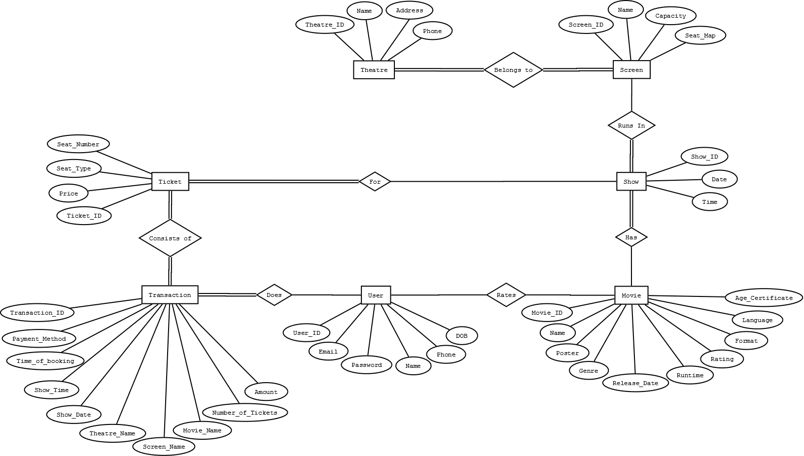

Handkerchief is an online movie ticket booking website where users can view the latest movies, their show times, and book tickets by selecting the seats of their choice. The GUI, including the seat map for theatre screens has been designed using HTML, CSS & JavaScript. The back-end of the website has been implemented using PHP. The database has been implemented using MySQL database.

To run the website:
1) Download and install Xampp: https://www.apachefriends.org/index.html (Apache Server)
2) Download the contents of the repository
3) Place the contents of the repository inside a folder, for example 'handkerchief'
4) Place the 'handkerchief' folder inside 'xampp/htdocs/'
5) Visit 'http://localhost/phpmyadmin' through a browser and create a new database. Import the database tables by choosing the 'handkerchief.sql' file
6) Open 'db.php' file and set the database details like username, password and database name
7) Finally, visit 'http://localhost/handkerchief/index.php' to load the index page

Database Design:

Screenshots:

1) Movies

2) Movie Details and it's Shows

3) Seat Selection

4) Confirmation of Booking

5) Booked Tickets inside Profile

6) Logout

7) Login

8) Signup

