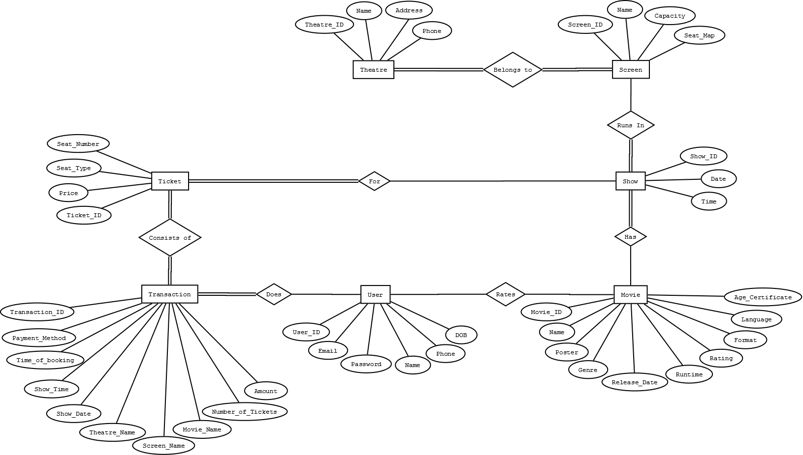
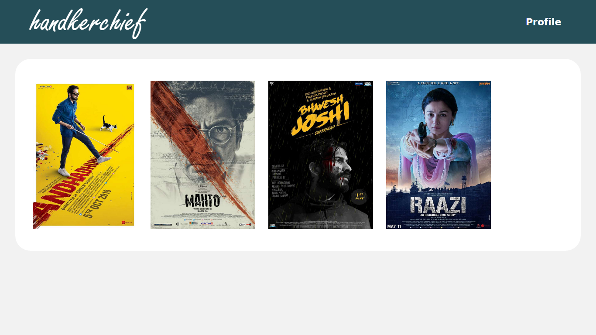
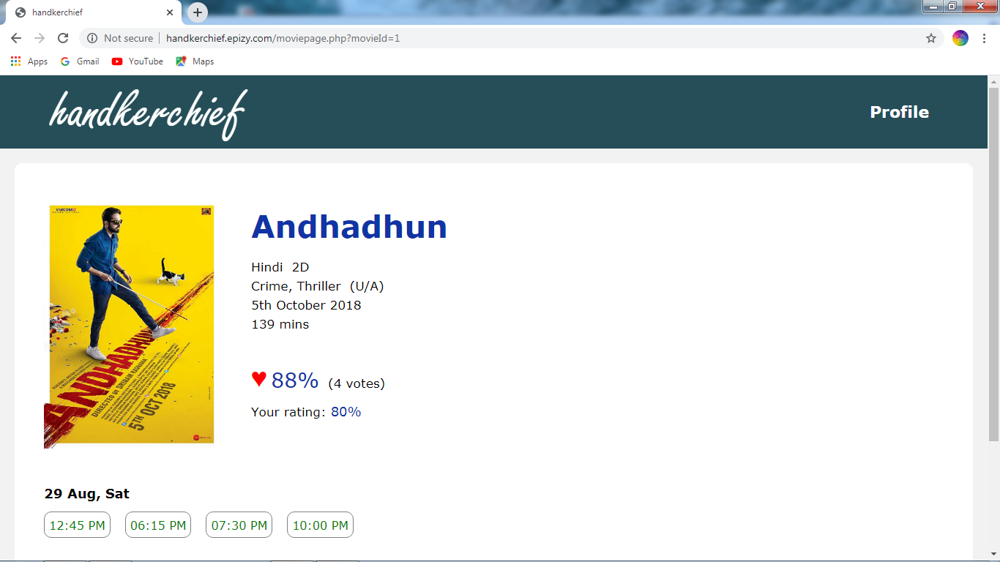
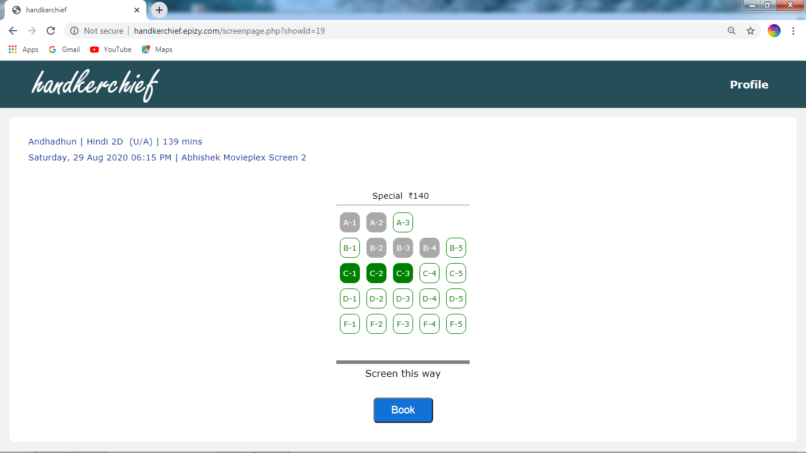
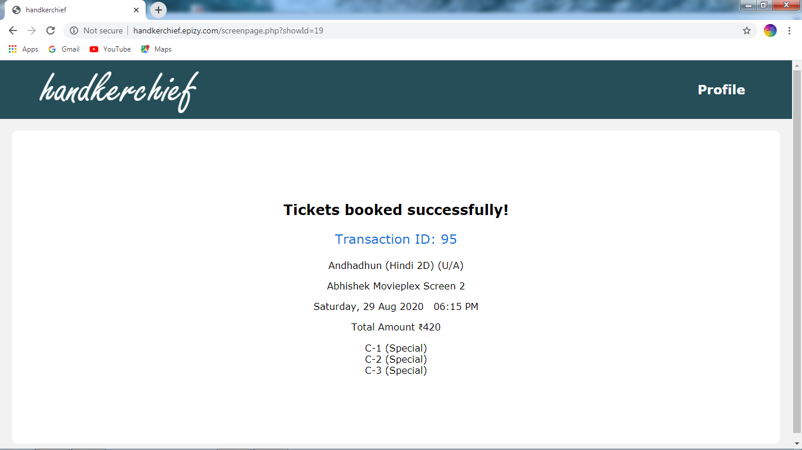
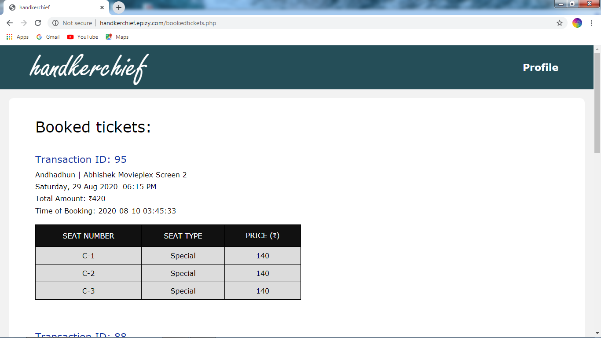
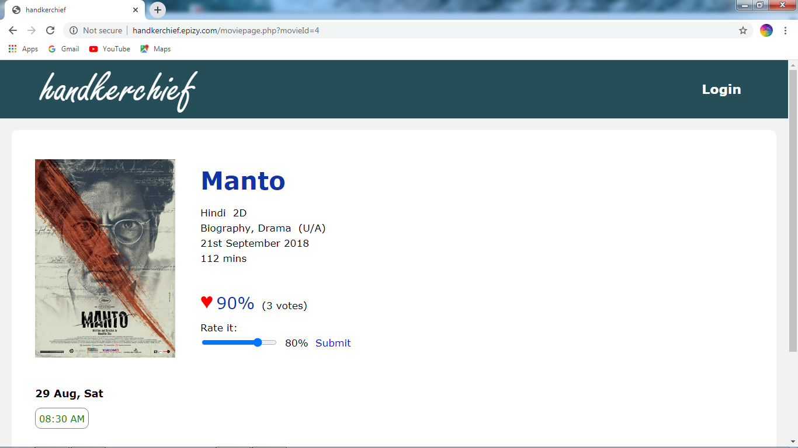
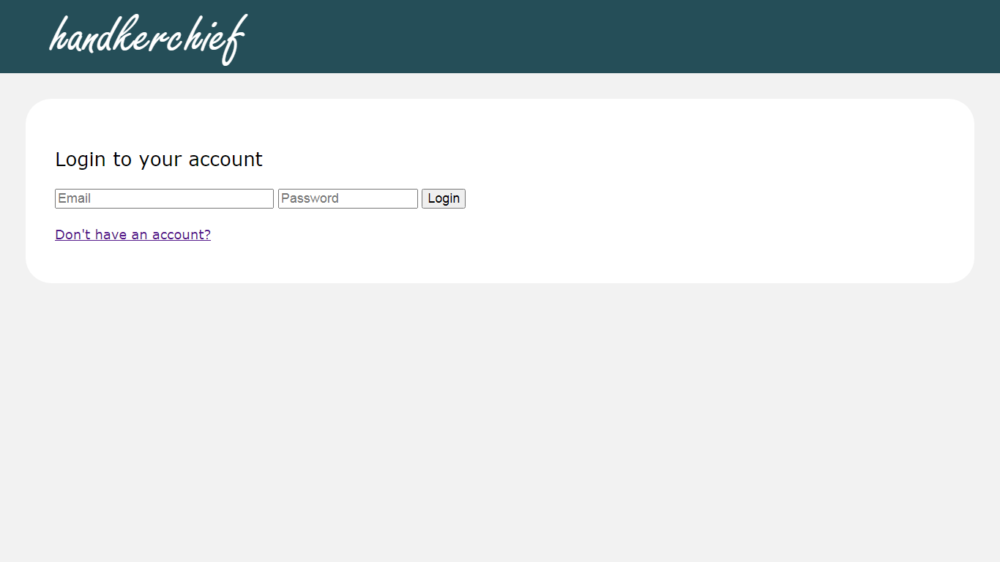
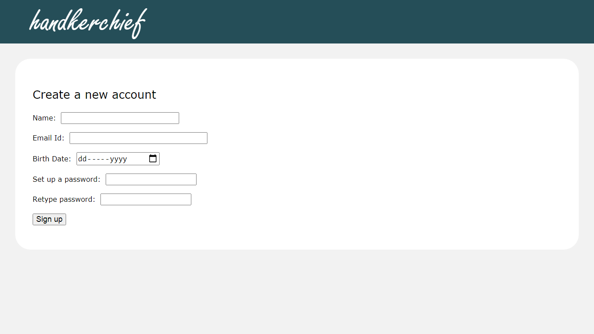

Handkerchief is a movie ticket booking website where users can view the latest movies, their show times, and book tickets by selecting the seats of their choice.  
The movies, their details, their shows and the available seats are dynamically fetched from the database. 
The tickets booked by the user are stored under a transaction in the database. 
The GUI, including the seat map of theatre screens has been designed using HTML, CSS & JavaScript. 
The back-end of the website has been implemented using PHP. 
The database has been implemented using MySQL database. 

Database structure

Screenshots:

1) Home page

2) Movie details and it's shows

3) Seat selection

4) Confirmation of booking

5) Booked tickets

6) Movie rating

7) Login

8) Signup

