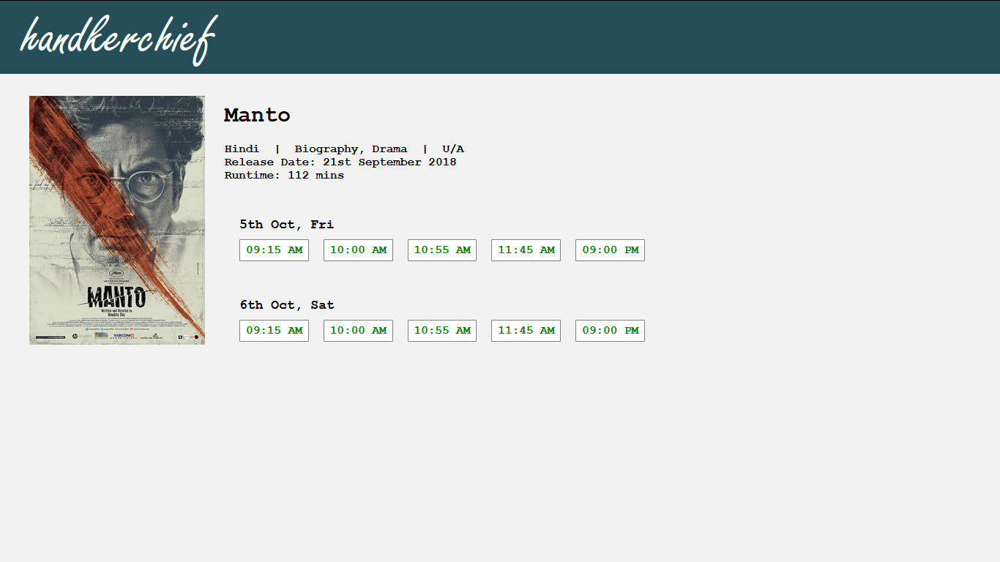

Handkerchief is an online movie ticket booking website like BookMyShow. The users can can view latest movies, their show times, and book tickets by selecting the seats of their choice. The GUI, including the seat map for theatre screens was designed using HTML, CSS & JavaScript. The back-end of the website was implemented using PHP. The database has been implemented using MySQL database.

A website where users can view latest movies, their show times, and book tickets by selecting the seats of their choice. The GUI, including the seat map for theatre screens was designed using HTML, CSS & JavaScript. The back-end of the website was implemented using PHP.

To run the website:
1) Download the contents of the repository
2) Place the contents of the repository inside a folder, for example 'handkerchief'
3) Place the 'handkerchief' folder inside 'xampp/htdocs'
4) Visit 'localhost/phpmyadmin' through a browser and create a new database. Import the database tables by choosing the 'handkerchief.sql' file
5) Open 'db.php' file and set the database details like username, password and database name
6) Finally, visit 'localhost/handkerchief/index.php' to load the homepage

Screenshots:

1) Movies

2) Movie details and showtimes

3) Select the seats

4) Booking confirmation

5) Booked tickets in the database

6) Movies in the database

7) Theatre screens

