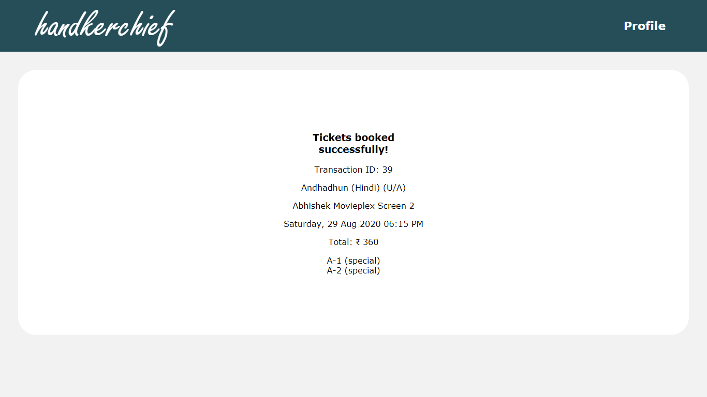
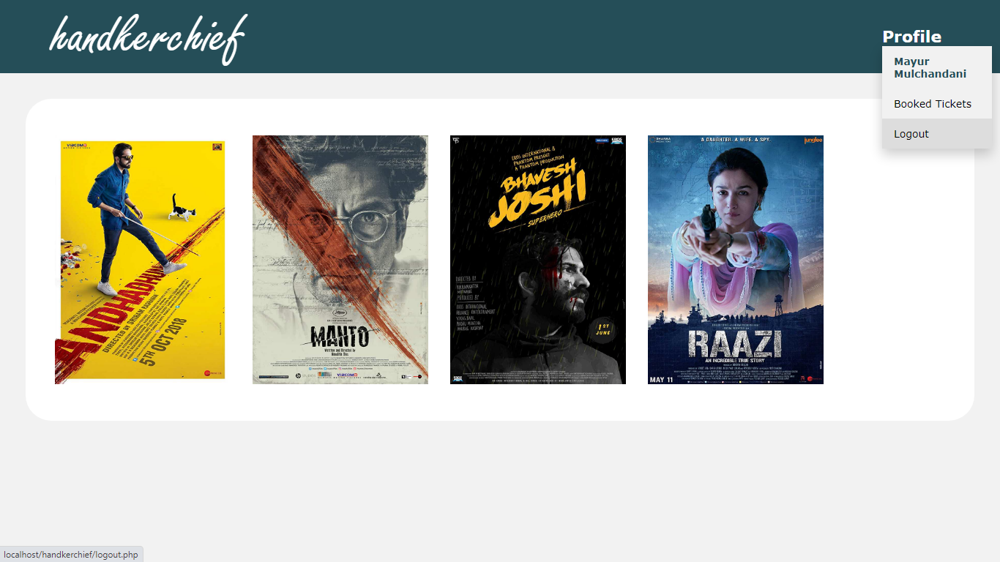

Handkerchief is a movie ticket booking website where users can view the latest movies, their show times, and book tickets by selecting the seats of their choice. The GUI, including the seat map for theatre screens has been designed using HTML, CSS & JavaScript. The back-end of the website has been implemented using PHP. The database has been implemented using MySQL database.

Screenshots:

1) Movies

2) Movie Details and it's Shows

3) Seat Selection

4) Confirmation of Booking

5) Booked Tickets inside Profile

6) Logout

7) Login

8) Signup

